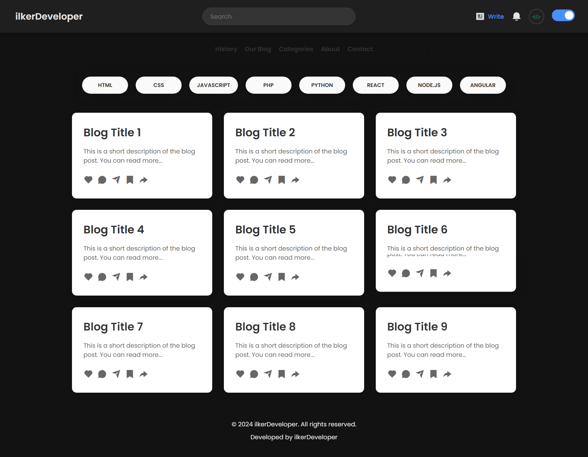

# ilkerDeveloper Blog Platform

This project is a blog platform created by ilkerDeveloper. Users can view and interact with articles related to different programming languages and technologies.

## Features

- **Category Filtering:** Filter articles by technologies such as HTML, CSS, JavaScript, PHP, Python, React, Node.js, and Angular.
- **Blog Cards:** Each blog card includes a short description, like, comment, share, and save icons.
- **Dark Mode Support:** Designed with a sleek dark theme.
- **Responsive Design:** Adaptable to various screen sizes.

## Screenshot

## Live Demo

Check out the live version here: [ilkerDeveloper Blog Demo](https://jade-elf-8b77dc.netlify.app/)

## Technologies Used

- **HTML5** and **CSS3:** For building the user interface.
- **JavaScript:** For dynamic components and interactions.

Developer: ilkerDeveloper
Year: 2024

